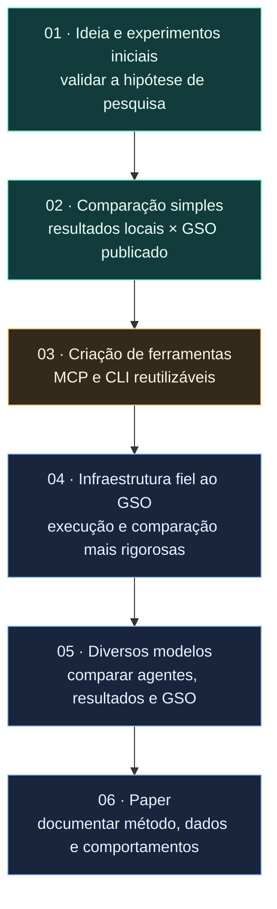

# HypEvolve

HypEvolve is a research framework that combines genetic algorithms, coding-agent CLIs, and deterministic evaluation to search for software optimizations.

## What the name means

**HypEvolve** combines **Hyp** (hypothesis) and **Evolve** (to evolve). The name describes the central idea: explicit, testable code hypotheses evolve through measured generations. The agent proposes a hypothesis, the deterministic harness evaluates it, and the next generation inherits the evidence collected so far.

## Fases e objetivos



As fases 1 e 2 já foram atingidas. O próximo objetivo é transformar o experimento em ferramentas MCP/CLI que possam ser usadas em outros projetos; depois, a pesquisa avança para infraestrutura mais fiel, comparação entre modelos e documentação em um paper.

## Research idea

Each individual is a persistent coding-agent session with its own workspace. HypEvolve compares this evolutionary lineage against an equal-budget sampling control in which independent agents start from pristine code. Correctness gates, repeated benchmarks, statistical significance, and hypothesis tracking keep the search grounded in evidence.

## Repository layout

- `hypevolve/`: typed Python framework, CLI, FastAPI server, contracts, evaluator, and orchestration loop.
- `experiments/`: smoke and real-target configurations.
- `scripts/`: experiment runners, analysis, and report generation.
- `docs/`: web control-plane documentation, research design, and the multilingual project page.
- `tests/`: unit, contract, integration, and smoke tests.

## Quick start

```bash
uv sync --extra dev
uv run pytest -q
make lint
```

Run the control plane:

```bash
uv run hypevolve serve --host 0.0.0.0 --port 8000
```

Run an experiment against a project checkout:

```bash
uv run hypevolve run \
  --target /path/to/project \
  --test-cmd 'python -m pytest -q' \
  --bench-cmd 'python benchmark.py' \
  --generations 10 \
  --max-hypotheses 40 \
  --harness codex
```

The CLI stores portable JSON artifacts under `results/<session>/`. The FastAPI panel reads the same artifacts through its REST API and exposes generations, prompts, agent output, deterministic test output, and editable hypotheses.

For direct use by coding agents, run `uv run hypevolve mcp`. It exposes the
same execution store through dependency-free MCP tools over stdio; see
[`docs/web-control-plane.md`](docs/web-control-plane.md#mcp-for-coding-agents)
for registration and tool usage.

## Quality gates

- Python dependencies are managed with UV and locked in `uv.lock`.
- New and modified Python code is fully typed and checked with strict Pyright.
- `icontract` expresses preconditions, postconditions, and invariants at state boundaries.
- CrossHair checks the formal contracts during `make lint`.
- Pytest covers the framework and its end-to-end smoke path.

## License

HypEvolve is released under the Apache License 2.0. Preserve the copyright and attribution notices in `LICENSE` and `NOTICE` when redistributing the project or derivative works.
